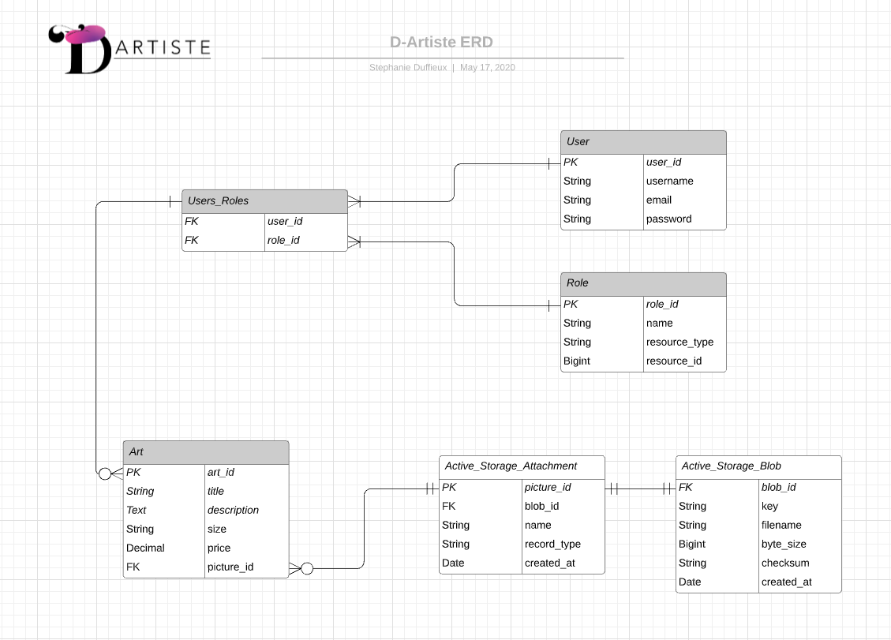

# T2A2 - Marketplace Project
T2A2 - Marketplace Project | By Stephanie Duffieux | May 2020


* [D'Artiste](https://d-artiste.herokuapp.com/) - Live website

* [Github](https://github.com/Beedeeboom/d-artiste/) - Github repository

## R7. Identification of the problem solved by building this particular marketplace app.

D'Artiste ("Digital Artist" with Artiste spelt the French way with an "e") is a marketplace application created for paint artists, digital artists and graphic designers of all genres to showcase and sell their artwork to art lovers. The purpose of D'Artiste is to allow artists to sell their art without the hassle of printing and posting. By removing the print side of purchasing art, this also reduces the cost of purchasing artworks as the buyer would simply be able to download a high quality print file with a maximum print size specified by the artist (e.g 100 x 150 cms) which they can then use to print with their local printer on a finishing and frame of their choice (e.g canvas print, giclee prints, hahnemuhle etching paper prints, watercolour prints etc...)


## R8. Why is it a problem that needs solving?

In today's modern society artists varying from paint artists, digital artists to graphic designers are in constant competition with the big chain stores such as Kmart, Target, Big-W, Spotlight (etc...) who sell a variety of low cost interior designs, including artworks, therefore leaving little to no room for competition for today's struggling artists. D'Artiste intends to pave the way and create a love for quality and unique art by allowing new and uprising artists to showcase their talents and to make a mark in the digital world. D'Artiste aims at building a community of art lovers who appreciate uniqueness and creativity.


## R9. Link to the deployed application:

D'Artiste Website - https://d-artiste.herokuapp.com/


## R10. Link to the application's GitHub repository:

Full source code of D'Artiste marketplace application is available on Github.

Github repository - https://github.com/Beedeeboom/d-artiste


## R11. Description of marketplace application, including:

### Purpose

D'Artiste is a two way marketplace application built for artists to show case and sell their digital artworks to art lovers. The purpose of the application is for art lovers to be able to purchase unique and creative digital art at a reduced cost. In order for the costs to be lower than artworks available on other platforms an artist simply sells their digital artwork as a high quality print file with an optimised maximum print size (e.g 100 x 150 cm) without providing printing and framing. The buyer can simply download their purchased artwork file and print with their preferred printer on their choice of print medium and framing. 

D'Artiste is a platform which aims at building a community of artists and art lovers. Artists of the D'Artiste community offer high quality designs at an affordable price.

### Functionality / features

* A Home page is displayed in the root path and greeting users to D'Artiste and prompting them to sign up or view art listing on the "Buy Art" tab. 

* An About page is accessible to the user in the navigation bar which describes the purpose and mission of the application.

* A Contact page is accessible to the user if they wish to contact the site admin.

* A recurrent navigation bar will be available to the user throughout the application allowing the user to easily navigate from one page to another, to sign up, log in, log out or to view their account.

* Users can access art listings on the "Buy Art" page without having to sign in or sign up. They can chose to preview any artwork with an option to purchase which then redirects the user to the payment portal.

* Users can sign up to sell their art by clicking the "Sign Up" link available in the navigation bar. The user is also prompted to sign up if they wish to sell their art on the "Home", "About" and "Buy Art" page. 

* Registered users have the possibility to add new art to their account by accessing the "My Account" tab within the navigation bar which is available to the user when they are signed in. 

* Registered and authorised users can view their art listing on the "My Account" tab and have the ability to edit or remove their artwork.


### Sitemap


### Screenshots

1. Home Page


2. About Page


3. Buy Art Page


4. My Account Page


5. User Preview Art Page


6. Buy Now Page


7. Order Preview, Checkout Page


8. Payment Page 


9. Contact Page


### Target audience

D'Artiste aims at attracting a two sided market with the target audience on one side of new and uprising artists of all genres, ranging from paint artists, digital artists to graphic designers and a target audience on another side of art lovers, modern interior enthusiasts between the ages of 25 to 45 seeking to purchase unique and creative digital artworks at a reduced cost. 

### Tech stack (e.g. html, css, deployment platform, etc)

* Rails version 6.0.3
* Ruby version 2.7.0
* Postgresql (database management)
* HTML 5
* SCSS/CSS
* Bootstrap (frontend styling)
* Heroku (deployment platform)
* Cloudinary (Cloud storage)
* Stripe (third party payment system)
* Devise (authentication gem)
* Rolify (authoristaion gem)
* Github (source control)
* Adobe Illustrator (Logo vector art)
* Adobe Photoshop (image resizing)
* Adobe XD (wireframe mockups)
* Unsplash (free stock images)
* Trello.com (project management, user stories)
* Lucid chart (Entity Relationship Diagram)
* Keynote (Slide deck presentation)


## R12. Application User Stories

User stories enable us to build a clear understanding of what is expected to achieve for a minimum viable product (MVP) and what we need to focus on to build all features and functions of our application. It is also important to allocate a size and order of importance to each of our User stories to ensure a MVP is delivered on time. To do this a Trello board was established to define the user features of D'Artiste marketplace application. Each feature was allocated a size from small, medium to large (green, orange, red) and a purple tag added for MVP user features. D'Artiste users can be either Artists or Buyers therefore the user stories were listed in three different columns with common user features in the "User Story" column, Artist features in the "Artist Story" column and the Buyer features in the "Buyer Story" Column.

Link to Trello Board User Stories - https://trello.com/b/eseB1FEr/d-artiste

#### Trello Board User Stories | Created May 10th, 2020

An initial list of user stories was created prior to building the application to establish the basic user features.


#### Trello Board User Stories | Updated 17th May, 2020

Extra user stories were added during the building process of the application.


## R13. Application Wireframes

### Mobile Wireframes


### Tablet Wireframes


### Desktop Wireframes


## R14. Entity Relationship Diagram

* [D'Artiste ERD](https://www.lucidchart.com/documents/edit/d4e6d123-1f4f-4b15-922a-76630efd8db0/0_0?beaconFlowId=827AD7F907796C98)

* Screenshot




## R15. Explain the different high-level components (abstractions) in your app

D'Artiste was built using the Model View Controller framework (MVC) and the Ruby programming language. The relationship between the Model, View and Controller is known as the Request-Response Cycle which uses a router to store pathways (URI's or Uniform Resource Identifier's) for each Controller action. When a user interacts with the application this sends a request to the router which prompts the Controller action. The Controller passes the request to the Model which retrieves the data from the database and returns it to the Controller. The Controller then exchanges the information from the Model with the View who in returns sends back the information to the Controller in the form of a HTML file. Finally the Controller is able to return to the information to the web browser in human readable language (HTML) for the user to view.

The application was built with the following high level components:

### Models

The application Models act as a link between the database and the Controllers. A Model can retrieve certain information from a database table it is linked to and then shares this information with a specific Controller action (class method). The application contains the following Models:

* User model
    * The User Model can access all the information relating to the User's table and User's Roles joined table stored in the database (username, email, password). The User model was generated with the Devise gem which enables the application to authenticate a user (sign up, sign in, password reset). The User model shares a relationship with both the Art and Role model enabling the application to pass permitted parameters set within the Arts Controller between these models. 

* Art model
    * The Art model can access the information belonging to a user's saved art listings within the database (title, description, size, price, picture). This model belongs to the User model and shares a relationship with the Active Storage Attachments table within the database (which stores pictures through a cloud bases platform).

* Role model
    The Role model was generated with the Rolify gem. Its main purpose is to authorise users to use certain parts of the application. When a user signs in they are assigned a default role of user, when they add art to their account their role changes to artist. The Role Model essentially interacts with the Arts Controller which permits authorised parameters from the Role Model to the View.

### Controllers

The application Controllers act as a middle man between the Models and the Views. When prompted by a route request A Controller will interact with the Model, retrieve the data from the Model and then pass the Information to the View. The View will return the information back to the Controller (in HTML) and the Controller will send this to the web browser. 

* Application controller
    * The Application Controller mainly contains the actions generated by the Devise gem (user authorisation).

* Arts controller
    * Contains most of the application actions. The Art Controller enables the user to create, save, edit, remove or view their art listings. It also contains actions which will permit certain parameters viewable by the user dependent if they are signed in, assigned a role or a non signed in user just browsing the application. 

* Orders controller
    * The Orders Controller actions are prompted when a user hits the "Buy Art" tab within the application browser. It allows all users even non registered users to view all art listings available for sale. It also enables the user to checkout and purchase any art listing and will render a "Complete" action when the order has been confirmed.

* Pages controller
    * The Pages controller contains actions which link to the "Home", "About" and "Contact" page. The "Home" page is used as the root route of the application. 

### Views

The application Views interact with the Controllers by sending HTML with embedded Ruby files to the Controller which passes the file to the web browser. Using embedded Ruby within the HTML files enables the relationship between the View and Controller which uses Ruby as its programming language. 

* Application Views
    * The Application View contains the sites navigation bar allowing the user to easily navigate from one page to another. The Application View is linked to all other Views within the application as it "yields" the HMTL from the other Views within its body.

* Arts Views
    The Art Views are made up of 5 different views (form, edit, index, new, show) which interact with the Arts Controller actions. Essentially the Art Views will render the information when a user creates, saves or removes an art listing.

* Devise Views
    * The Devise Views are automatically generated when installing the Devise gem. The Devise Views allow the user the sign up, log in or retrieve their password. The Devise Views mainly interact with the Arts Controller actions. 

* Pages Views
    * The Page Views render the Home, About and Contact page which allows the user to understand the purpose and use of the application. 

### MVP components of D'Artiste:

A user can navigate through the application, view the Home page which prompts the user to join the D'Artiste community and either view art listings through the "Buy Art" tab or sign up as an artist to sell their art. A user can also view the About page which gives an overview of the applications purpose and mission.

As a marketplace application, D'Artiste enables its users to view artworks listed for sale by other users, each artwork will show a title, artist name, description, size and price. A user can navigate through the main pages of the application "home, about, contact, buy art" without having to sign in or register an account and is able to select and preview artworks they wish to purchase. A user can also proceed to the "checkout" and pay using a credit or debit card (only test mode payment at this stage).

A registered user of the application can log in and view their account through the "My Account" tab which contains a list of their artworks available for sale to other users. In the same tab a registered user can add new artworks to their account and can edit or remove existing artworks. When creating and uploading a new artwork to their account a registered user is prompted to add a title, description, size, price and picture to their listing. So to add a personalised touch to the user's experience, when a user is signed in they can view a "Welcome, username" greeting in the splash image section when they visit their account page and the "Buy Art" page.

* Extras to the MVP components which will be added at a later time:

    * Chat/messenger function which will allow potential art buyers to chat directly with artists. 
    * Search functionality in the navigation bar which will allow users to search through the application for specific arts.
    * Admin dashboard which will allow authorised admin users to fully control the application.
    * Buyer dashboard which will allow registered users to view a list of their purchased artworks.


## R16. Detail any third party services that your app will use

D'Artiste will make use to the following third party services:

* Heroku - https://dashboard.heroku.com/apps

    * Heroku is used as a deployment platform for D'Artiste marketplace application.
    Heroku is a popular cloud platform which developers use to deploy and manage their applications. Heroku uses Git as its primary means for deploying applications meaning similar commands used with Github are used with Heroku (e.g git push heroku master would push our master branch to the Heroku platform).

* Cloudinary - https://cloudinary.com/

    * Cloudinary is used to store user image uploads on D'Artiste marketplace application.
    Cloudinary is an easy to use cloud-based image and video management platform. Using a cloud based system to store images enables to optimise site performance and user experience with faster page load times.

* Devise gem - https://github.com/heartcombo/devise

    * Devise is a popular gem used with Rails which provides an effective and secure solution to authenticate users. Devise provides all the functionalities and helper methods to allow application users to sign up and log in. Devise can be installed to a Rails application by simply adding it to our Gemfile "gem 'devise", running a bundle install and finalising the installation with the "rails generate devise:install" command line. 

* Rolify gem - https://github.com/RolifyCommunity/rolify

    * Similar to Devise, Rolify is a popular gem used with Rails to authorise user access within an application and assigning roles to specific users. With Rolify we can specify what users can access and what they can view on each page. Within D'Artiste marketplace application, Rolify is used to assign a default role to users when they sign up and then assigns a role "artist" to users who create and save new artwork listings to their account and giving ownership to the user of their artwork.

* Stripe - https://stripe.com/au

    * Stripe is a PCI (Payment Card Industry) compliant payment platform which gives online businesses and marketplace applications the ability to accept online credit or debit card payments from their users. D'Artiste marketplace application integrates Stripe as its checkout payment system, although at this stage the payment system in D'Artiste is only available in test mode.

* PostgreSQL - https://www.postgresql.org/

    * PostgreSQL is used as a relational database management system for D'Artiste marketplace. PostgreSQL is Multi-version Concurrency Control (MVCC) allowing changes to be made to the database without affecting other transactions. 


## R17. Describe your projects models in terms of the relationships (active record associations) they have with each other

In order to make common operations easier and simpler between our models Rails Active Record associations allows us to connect our models to each other by declaring the type of association between each model. By associating models we can easily pass and relate the stored data from one model to the other. D'Artiste marketplace application contains three main models; User, Role and Art which relate to each other in the following ways:

* The User model
    * Has_many Arts
    * Assigned a default role upon registration
    * Assigned an artist role upon creation of Art

The User model shares a relationship with the Art and Role model. A User can have many Arts and is assigned a default role upon registration. When a user signs up they are given a default role of ":user". Upon creating and saving a new art listing the user will be given an "artist" role with the specific "art_id" belonging to the user, this allows the application to give ownership of an artwork to a specific user and linking the data instances to each other.

The User model can access the details of each registered user (with the user's username, email and password stored in the database). The application will only prompt the user to sign up if they wish to list their art for sale (The Devise gem is used with our User model to authenticate users). Any user wishing to browse the application's art listings is not required to sign up or sign in. However, strong parameters have been added to the Arts controller to ensure private params are secured between the User and Art model. The default "user_id" stored upon registration of a user can also be used for future purposes when a buyer dashboard will be created. For now we are mainly concentrating on the application's MVP.

* Role model
    * Has_and_belongs_to_many Users

The Role model shares a relationship with the User model through the Users_Roles joined table. A Role has and belongs to many users. As described in the User model, a default user role will be assigned to a user when they sign up and a role of artist will be assigned to the user when they create and save a new art listing.


* Art model
    * Belongs_to User
    * Has_one_attached picture (through Active Storage Attachments)

The Art model can access all the information relating to art listings from the database (title, description, artist name, price and picture). One artwork "Art" belongs to a specific user, here we are calling the "belongs_to association between the Art and User model (A User has many Arts). An Art will be deleted if its User no longer exits, this is automatically generated within the User model with the "dependent: :destroy" method. The Art model also holds a "has_one_attached" relationship with the Active Storage Attachment table within the database. A User is prompted to add a picture of their Art upon creation which will then prompt the Active Storage Attachment table to store the picture within our cloud based storage platform (Cloudinary), through the Active Storage Blob table.


## R18. Discuss the database relations to be implemented in your application

Further to the application's Entity Relationship Diagram which depicts how entities relate to each other within the application the database relations are implemented within the following tables :

* Active Storage Attachments 
    * Contains the storage attachments (pictures) saved by the user when creating a new art listing. This table will store the name of the file, its record type, record id and a blob_id which is a foreign key from the Active Storage Blobs table.

* Active Storage Blobs
    * The Active Storage Blobs table forms a relationship with the active Active Storage Attachments table, it contains many active storages (pictures) from that table. When a picture is added from the Art table all the metadata of the file, file name, byte size and key are stored in the Active Storage Blobs table and passed to the cloud based platform (Cloudinary) which stores the picture.

* Arts
    * The Arts table stores all the information about art listings created and saved by registered Users; title, description, size, price and user_id. It forms a relationship with the Users and Roles table through the Users_Roles joined table which contains both the user_id and role_id foreign keys. The Art table data only exists when it belongs to a User with a Role. The Arts table also forms a relationship with the Active Storage Attachments table through its foreign key which enables the Art table to store a picture to a cloud based platform (Cloudinary).

* Roles
    * The Roles table implemented with the Rolify gem, holds the role name, resource type, and resource id. Its primary key "role_id" holds a relationship with the Users table through the Users_Roles joined table. Users are given a default role of "user" when they sign up and are also given the role of "artist" when they add art listings to their account. 

* Users
    * The Users table implemented with the Devise gem, holds data which identifies a user by its unique username, email and password(encrypted). The User table forms a relationship with the Art table through the Users_Roles joined table which passes a role_id to the User allowing the User table to create ownership of the Art table elements belonging to a unique user. A User table can have many Arts.

* Users Roles (joined table)
    * The User Roles table is a joined table used to link both the User and Role table to the Art table. This table contains both the "user_id" and "role_id" foreign keys which allow the joined table relationship.


## R19. Provide your database schema design</summary>

* Code snippet of D'Artiste marketplace application schema design:

    ```
        ActiveRecord::Schema.define(version: 2020_05_16_112334) do

        # These are extensions that must be enabled in order to support this database
        enable_extension "plpgsql"

        create_table "active_storage_attachments", force: :cascade do |t|
            t.string "name", null: false
            t.string "record_type", null: false
            t.bigint "record_id", null: false
            t.bigint "blob_id", null: false
            t.datetime "created_at", null: false
            t.index ["blob_id"], name: "index_active_storage_attachments_on_blob_id"
            t.index ["record_type", "record_id", "name", "blob_id"], name: "index_active_storage_attachments_uniqueness", unique: true
        end

        create_table "active_storage_blobs", force: :cascade do |t|
            t.string "key", null: false
            t.string "filename", null: false
            t.string "content_type"
            t.text "metadata"
            t.bigint "byte_size", null: false
            t.string "checksum", null: false
            t.datetime "created_at", null: false
            t.index ["key"], name: "index_active_storage_blobs_on_key", unique: true
        end

        create_table "arts", force: :cascade do |t|
            t.string "title"
            t.text "description"
            t.string "size"
            t.decimal "price"
            t.bigint "user_id", null: false
            t.datetime "created_at", precision: 6, null: false
            t.datetime "updated_at", precision: 6, null: false
            t.index ["user_id"], name: "index_arts_on_user_id"
        end

        create_table "roles", force: :cascade do |t|
            t.string "name"
            t.string "resource_type"
            t.bigint "resource_id"
            t.datetime "created_at", precision: 6, null: false
            t.datetime "updated_at", precision: 6, null: false
            t.index ["name", "resource_type", "resource_id"], name: "index_roles_on_name_and_resource_type_and_resource_id"
            t.index ["resource_type", "resource_id"], name: "index_roles_on_resource_type_and_resource_id"
        end

        create_table "users", force: :cascade do |t|
            t.string "email", default: "", null: false
            t.string "encrypted_password", default: "", null: false
            t.string "reset_password_token"
            t.datetime "reset_password_sent_at"
            t.datetime "remember_created_at"
            t.datetime "created_at", precision: 6, null: false
            t.datetime "updated_at", precision: 6, null: false
            t.string "username"
            t.index ["email"], name: "index_users_on_email", unique: true
            t.index ["reset_password_token"], name: "index_users_on_reset_password_token", unique: true
            t.index ["username"], name: "index_users_on_username", unique: true
        end

        create_table "users_roles", id: false, force: :cascade do |t|
            t.bigint "user_id"
            t.bigint "role_id"
            t.index ["role_id"], name: "index_users_roles_on_role_id"
            t.index ["user_id", "role_id"], name: "index_users_roles_on_user_id_and_role_id"
            t.index ["user_id"], name: "index_users_roles_on_user_id"
        end

        add_foreign_key "active_storage_attachments", "active_storage_blobs", column: "blob_id"
        add_foreign_key "arts", "users"
        end
    ```


## R20. Describe the way tasks are allocated and tracked in your project

Efficient project management enables us to keep track of priorities by breaking down all project tasks needed to ensure we create a product within a certain timeframe and making sure we deliver a minimum viable product (MVP). 

In order to allocate and keep track of tasks during the creation of D'Artiste marketplace application a Trello board was implemented at the start of the project with a list of "To Do" items in order of priority (tagged purple for MVP) and order of size from small, medium to large (green orange, red). A second column "Doing" was added to the Trello board in order to move tasks as they are being completed and a third column "Done" was added to keep track of completed tasks. 

* The full and complete version of the D'Artiste Trello board can be viewed at - https://trello.com/b/eseB1FEr/d-artiste

#### Trello board task allocation and managment | Created May 10th, 2020


#### Trello board task allocation and managment | Updated 13th May, 2020


#### Trello board task allocation and managment | Updated 17th May, 2020


